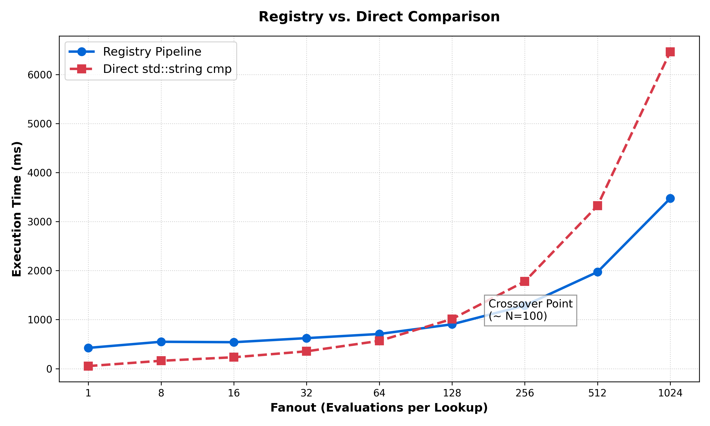

## Symbol Interning vs. Direct Comparison




```bash
micrometrics - string-interning vs direct-string comparison
Iterations : 10000000
Symbol pool: 45 unique symbols

---> 1-to-1  (one lookup / comparison per incoming symbol)
Method                                   Time (ms)     Matches
--------------------------------------------------------------
Registry (lookup + ID cmp)                 422.531      221483
Direct std::string cmp                      52.070      221483
--------------------------------------------------------------
  Direct is 8.11x faster than registry.

---> 1-to-many  fanout=8  (one lookup reused across N operations)
Method                                   Time (ms)     Matches
--------------------------------------------------------------
Registry (lookup + NxID cmp)                548.01     1771864
Direct Nxstd::string cmp                    160.34     1771864
--------------------------------------------------------------
  Direct is 3.42x faster than registry.

---> 1-to-many  fanout=16  (one lookup reused across N operations)
Method                                   Time (ms)     Matches
--------------------------------------------------------------
Registry (lookup + NxID cmp)                538.83     3543728
Direct Nxstd::string cmp                    232.15     3543728
--------------------------------------------------------------
  Direct is 2.32x faster than registry.

---> 1-to-many  fanout=32  (one lookup reused across N operations)
Method                                   Time (ms)     Matches
--------------------------------------------------------------
Registry (lookup + NxID cmp)                621.52     7087456
Direct Nxstd::string cmp                    352.98     7087456
--------------------------------------------------------------
  Direct is 1.76x faster than registry.

---> 1-to-many  fanout=64  (one lookup reused across N operations)
Method                                   Time (ms)     Matches
--------------------------------------------------------------
Registry (lookup + NxID cmp)                707.14    14174912
Direct Nxstd::string cmp                    565.68    14174912
--------------------------------------------------------------
  Direct is 1.25x faster than registry.

---> 1-to-many  fanout=128  (one lookup reused across N operations)
Method                                   Time (ms)     Matches
--------------------------------------------------------------
Registry (lookup + NxID cmp)                903.53    28349824
Direct Nxstd::string cmp                   1011.86    28349824
--------------------------------------------------------------
  Registry is 1.12x faster than direct.

---> 1-to-many  fanout=256  (one lookup reused across N operations)
Method                                   Time (ms)     Matches
--------------------------------------------------------------
Registry (lookup + NxID cmp)               1287.93    56699648
Direct Nxstd::string cmp                   1778.46    56699648
--------------------------------------------------------------
  Registry is 1.38x faster than direct.

---> 1-to-many  fanout=512  (one lookup reused across N operations)
Method                                   Time (ms)     Matches
--------------------------------------------------------------
Registry (lookup + NxID cmp)               1971.74   113399296
Direct Nxstd::string cmp                   3324.33   113399296
--------------------------------------------------------------
  Registry is 1.69x faster than direct.

---> 1-to-many  fanout=1024  (one lookup reused across N operations)
Method                                   Time (ms)     Matches
--------------------------------------------------------------
Registry (lookup + NxID cmp)               3474.27   226798592
Direct Nxstd::string cmp                   6463.97   226798592
--------------------------------------------------------------
  Registry is 1.86x faster than direct.


--> 1-to-many summary (fanout sweep 8 to 1024)
    Fanout    Reg (ms)    Dir (ms)     Speedup      Winner
------------------------------------------------------
         8     548.011     160.343        3.42      Direct
        16     538.830     232.147        2.32      Direct
        32     621.519     352.975        1.76      Direct
        64     707.145     565.677        1.25      Direct
       128     903.532    1011.861        1.12    Registry
       256    1287.934    1778.460        1.38    Registry
       512    1971.741    3324.334        1.69    Registry
      1024    3474.271    6463.969        1.86    Registry
------------------------------------------------------
```
