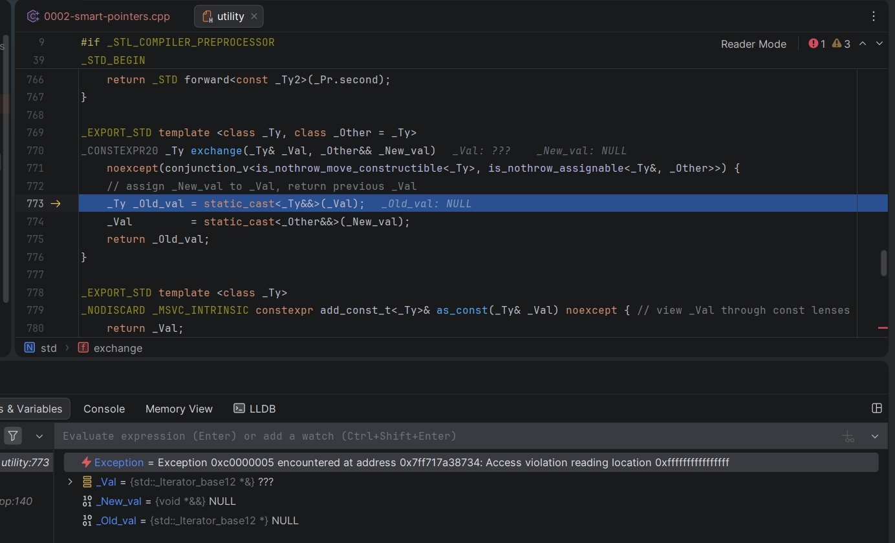

# Smart Pointers

## Section 1  
```bash
   Section 1: simple-creation

--- unique_ptr ---
  [+] Resource(unique)
  Resource::greet()- unique
  raw ptr via get() : 0000019298294E00
  [-] ~Resource(unique)

--- unique_ptr (array) ---
  arr[0] = 10
  arr[1] = 20
  arr[2] = 30

--- shared_ptr ---
  [+] Resource(shared)
  use_count = 1
  use_count after copy = 2
  Resource::greet()- shared
  use_count after s2 scope = 1
  [-] ~Resource(shared)

--- weak_ptr ---
  [+] Resource(observed)
  expired() while owner alive : false
  Resource::greet()- observed
  [-] ~Resource(observed)
  expired() after owner gone  : true
  lock() returns null         : true

   done
```
## Section 2  



```bash
   Section 2: double-ownership (UB)

--- two shared_ptr from the same raw pointer (UB) ---
  NOTE: this is undefined behaviour- double-free expected

  [+] Resource(double-owned)
  sp1 use_count : 1
  sp2 use_count : 1
  Resource::greet()- double-owned
  Resource::greet()- double-owned
  leaving scope- first delete is fine, second is UB...
  [-] ~Resource(double-owned)
  [-] ~Resource(Segmentation fault
``` 
## Section 3  
```bash
   Section 3: move-semantics

--- std::move with unique_ptr ---
  [+] Resource(u-move)
  u1 before move : 0000024454A068C0
  u1 after  move : 0000000000000000 (null=1)
  u2 after  move : 0000024454A068C0
  Resource::greet()- u-move
  [-] ~Resource(u-move)

--- passing unique_ptr into a function (sink) ---
  [+] Resource(u-sink)
  function owns:   Resource::greet()- u-sink
  [-] ~Resource(u-sink)
  u is now null : 1

--- std::move with shared_ptr (no ref-count bump) ---
  [+] Resource(s-move)
  use_count before move : 1
  s1 null after move    : 1
  s2 use_count          : 1
  Resource::greet()- s-move
  [-] ~Resource(s-move)

--- move into a vector (unique_ptr) ---
  [+] Resource(v0)
  [+] Resource(v1)
  [+] Resource(v2)
  Resource::greet()- v0
  Resource::greet()- v1
  Resource::greet()- v2
  [-] ~Resource(v0)
  [-] ~Resource(v1)
  [-] ~Resource(v2)

   done
```

## Section 4  
```bash
   Section 4: shared-from-this

--- shared_from_this: safe self shared_ptr ---
  [+] Node(root)
  use_count after self() : 2
  same object            : 1
  [-] ~Node(root)

--- cycle-safe tree with weak_ptr parent links ---
  [+] Node(root)
  [+] Node(child)
  [+] Node(grandchild)
  root  use_count : 1
  child use_count : 2
  grand->parent id : child
  child->parent id : root
  [-] ~Node(root)
  [-] ~Node(child)
  [-] ~Node(grandchild)

--- UB: shared_from_this on a stack object ---
  NOTE: calling shared_from_this() on an object not managed
        by any shared_ptr throws std::bad_weak_ptr (C++17).

  [+] Node(stack)
  caught std::bad_weak_ptr: bad_weak_ptr
  [-] ~Node(stack)

   done
```

## Section 5  
```bash
Section 5: ref-counters

--- strong (use) count ---
[+] Resource(rc)
after make_shared          strong=1
after copy  (sp2=sp1)      strong=2
after copy  (sp3=sp1)      strong=3
after sp2.reset()          strong=2
after move to sp4          strong=2
sp3 is null                : 1
after sp4 scope            strong=1
[-] ~Resource(rc)

--- weak count (inferred via expired / lock) ---
[+] Resource(wc)
after make_shared          strong=1
after wp1=sp               strong=1  wp1.expired=0
after wp2=wp1              strong=1  wp2.expired=0
after wp3=sp               strong=1  wp3.expired=0
during wp1.lock()          strong=2
after lock scope           strong=1
after wp2.reset()          wp2.expired=1
[-] ~Resource(wc)
after sp scope             wp1.expired=1  wp3.expired=1
lock() on expired wp       null=1

--- shared_ptr from weak_ptr::lock() bumps strong ---
[+] Resource(lock-bump)
strong before lock : 1
strong during lock : 2
same ptr           : 1
strong after lock  : 1
[-] ~Resource(lock-bump)

done
```